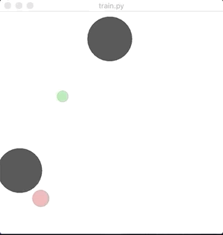
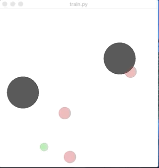
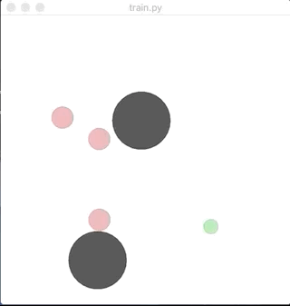
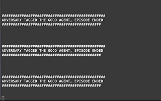

# RL TAG GAME
A game of tag with 2 autonomous agents in a 2D environment. The game generation begins with a "tagger" agent whose goal is to tag the other agent, and a second "escaper" agent whose goal is to escape this tagger. The generation ends after either the tagger agent touches the escaper (in which case the tagger wins), or after a fixed number of timesteps elapsed (in which case the escaper wins). 
The tagger and escaper do not ever swap roles; each agent retains his goal across generations.

# References
In order to make this I have used a simple multi-agent particle world with a continuous observation and discrete action space, along with some basic simulated physics and the MADDPG 
algorithm mentioned in the paper [Multi-Agent Actor-Critic for Mixed Cooperative-Competitive Environments](https://arxiv.org/pdf/1706.02275.pdf), 
I forked  [Multi-Agent Particle Environment](https://github.com/openai/multiagent-particle-envs) and used it.

#Modifications:
I have tweaked some changes in the original environments regarding the agents numbers and speed and accelerations also, 
I have added a done callback to terminate the episode once the escapper is tagged also when escapper got out of bounds but this will be commented 
in the code so episode will terminate only if the agent got tagged.

All the code is implemented using pytorch and I have tried new architecture for the neural networks that 
also gave a good results.

## Getting started:

- git clone 

- To install, `cd` into the root directory and type `pip install -e`.

- To interactively view moving to landmark scenario (see others in ./scenarios/):
`bin/interactive.py --scenario simple.py`

- Known dependencies: Python (3.5.4), OpenAI gym (0.10.5), numpy (1.14.5), pytorch (1.4.0)

- To start the training cd to the main directory:
   `python main.py`
   
- To display the existing models weights and see how they perform, just provide the display flag and if you want you can choose the number of the tagger agents using `--num_adversaries=3` for example :
    `python main.py --display --num_adversaries=3`
- By default the number of taggers is 1 and its policy is DDPG because as mentioned in the paper, 
training the "taggers" with DDPG and the "escaper" with MADDPG provided better results.
- Check `train.py` to see more options for the flags and their corresponding descriptions.

## Code structure

- `make_env.py`: contains code for importing a multiagent environment as an OpenAI Gym-like object.

- `./multiagent/environment.py`: contains code for environment simulation (interaction physics, `_step()` function, etc.)

- `./multiagent/core.py`: contains classes for various objects (Entities, Landmarks, Agents, etc.) that are used throughout the code.

- `./multiagent/rendering.py`: used for displaying agent behaviors on the screen.

- `./multiagent/policy.py`: contains code for interactive policy based on keyboard input.

- `./multiagent/scenario.py`: contains base scenario object that is extended for all scenarios.

- `./multiagent/scenarios/`: folder where various scenarios/ environments are stored. scenario code consists of several functions:
    1) `make_world()`: creates all of the entities that inhabit the world (landmarks, agents, etc.), assigns their capabilities (whether they can communicate, or move, or both).
     called once at the beginning of each training session
    2) `reset_world()`: resets the world by assigning properties (position, color, etc.) to all entities in the world
    called before every episode (including after make_world() before the first episode)
    3) `reward()`: defines the reward function for a given agent
    4) `observation()`: defines the observation space of a given agent
    5) (optional) `benchmark_data()`: provides diagnostic data for policies trained on the environment (e.g. evaluation metrics)
    
- `replay_buffer.py`: contains code for the buffer needed in training.
- `ornsteinUhlenbeck.py`: contains code for creating OrnsteinUhlenbeck process.
- `agent.py`: contains the code for the MADDPG algorithm and the agent functions.
- `actor_critic_model.py`: contains the code for the critic and the actor neural network architecture.
- `finalTaining.ipynb`: jupyter notebook to train the code on google colab.
- `checkpoints_{escaper_algorithm}_{tagger_algorithm}_{number_of_adversaries}`: Directories contains the weights saved from 
the training 

### Creating new environments

You can create new scenarios by implementing the first 4 functions above (`make_world()`, `reset_world()`, `reward()`, and `observation()`).

## List of environments

| Env name in code (name in paper) |  Communication? | Competitive? | Notes |
| --- | --- | --- | --- |
| `simple_tag.py` (Predator-prey) | N | Y | Predator-prey environment. Good agents (green) are faster and want to avoid being hit by adversaries (red). Adversaries are slower and want to hit good agents. Obstacles (large black circles) block the way. |

## Results:

-1vs1 scenario:
    
  
 
-3vs1 scenario (taggers using DDPG vs escapers using MADDPG):
 
  
 
-3vs1 scenario (taggers using MADDPG vs escapers using DDPG): 
   

 
- In the display mode we can also see who won in the terminal:
 

 

## Paper citation

Environments in this repo:
<pre>
@article{lowe2017multi,
  title={Multi-Agent Actor-Critic for Mixed Cooperative-Competitive Environments},
  author={Lowe, Ryan and Wu, Yi and Tamar, Aviv and Harb, Jean and Abbeel, Pieter and Mordatch, Igor},
  journal={Neural Information Processing Systems (NIPS)},
  year={2017}
}
</pre>

Original particle world environment:
<pre>
@article{mordatch2017emergence,
  title={Emergence of Grounded Compositional Language in Multi-Agent Populations},
  author={Mordatch, Igor and Abbeel, Pieter},
  journal={arXiv preprint arXiv:1703.04908},
  year={2017}
}
</pre>
